# 🌐 Sosyal Ağ Analizi Uygulaması

**Kocaeli Üniversitesi**  
**Teknoloji Fakültesi - Bilişim Sistemleri Mühendisliği**  
**Yazılım Geliştirme Laboratuvarı-I**  
**Proje-2**

---

## 👥 Ekip Bilgileri

| Öğrenci No | Ad Soyad |
|------------|----------|
| 231307077 | Duha Yusuf Bindere |
| 231307094 | Ahmet Öz |

**Tarih:** 1 Ocak 2026

---

## 📑 İçindekiler

1. [Giriş](#1-giriş)
2. [Problem Tanımı ve Amaç](#2-problem-tanımı-ve-amaç)
3. [Kullanılan Teknolojiler](#3-kullanılan-teknolojiler)
4. [Sistem Mimarisi ve Sınıf Yapısı](#4-sistem-mimarisi-ve-sınıf-yapısı)
5. [Algoritmalar](#5-algoritmalar)
6. [Dinamik Ağırlık Hesaplama](#6-dinamik-ağırlık-hesaplama)
7. [Kullanıcı Arayüzü](#7-kullanıcı-arayüzü)
8. [Test Sonuçları ve Performans Analizi](#8-test-sonuçları-ve-performans-analizi)
9. [Kurulum ve Çalıştırma](#9-kurulum-ve-çalıştırma)
10. [Sonuç ve Tartışma](#10-sonuç-ve-tartışma)
11. [Kaynakça](#11-kaynakça)

---

## 1. Giriş

Sosyal ağlar, günümüzde milyarlarca insanın iletişim kurduğu, bilgi paylaştığı ve topluluklar oluşturduğu dijital platformlardır. Bu ağların analizi; kullanıcı davranışlarını anlamak, toplulukları tespit etmek, etkili bireyleri belirlemek ve bilgi yayılımını modellemek açısından kritik öneme sahiptir.

Bu proje kapsamında, kullanıcılar arasındaki ilişkileri **graf veri yapısı** ile modelleyen, çeşitli **graf algoritmaları** uygulayarak sosyal ağ üzerindeki bağlantıları analiz eden interaktif bir masaüstü uygulaması geliştirilmiştir.

### Projenin Kapsamı

- Graf tabanlı sosyal ağ modelleme
- Dinamik düğüm ve kenar yönetimi
- Çoklu algoritma desteği (BFS, DFS, Dijkstra, A*, Welsh-Powell vb.)
- Görsel analiz ve renklendirme
- Veri içe/dışa aktarımı (JSON)

---

## 2. Problem Tanımı ve Amaç

### 2.1 Problem Tanımı

Sosyal ağlarda kullanıcılar arasındaki ilişkilerin analiz edilmesi, aşağıdaki soruların cevaplanmasını gerektirir:

1. **Erişilebilirlik:** Bir kullanıcıdan hangi kullanıcılara ulaşılabilir?
2. **En Kısa Yol:** İki kullanıcı arasındaki en kısa bağlantı nedir?
3. **Topluluk Tespiti:** Ağda birbirinden bağımsız kaç topluluk var?
4. **Etki Analizi:** En etkili (merkezi) kullanıcılar kimler?
5. **Renklendirme:** Komşu kullanıcıları minimum renk sayısıyla nasıl ayırt edebiliriz?

### 2.2 Amaç

Bu proje ile aşağıdaki hedeflere ulaşılması amaçlanmaktadır:

- Graf veri yapılarının etkin kullanımı
- Temel graf algoritmalarının implementasyonu
- Nesne yönelimli programlama prensiplerinin uygulanması
- Kullanıcı dostu görsel arayüz tasarımı
- Performans analizi ve optimizasyon

---

## 3. Kullanılan Teknolojiler

| Teknoloji | Versiyon | Kullanım Amacı |
|-----------|----------|----------------|
| Python | 3.10+ | Ana programlama dili |
| PyQt5 | 5.15+ | Grafiksel kullanıcı arayüzü |
| JSON | - | Veri saklama formatı |

---

## 4. Sistem Mimarisi ve Sınıf Yapısı

### 4.1 Proje Dosya Yapısı

```
yazlab1-2/
├── main.py                 # Ana giriş noktası
├── gui.py                  # Ana GUI bileşenleri
├── data_io.py              # Veri okuma/yazma işlemleri
├── weight_calc.py          # Kenar ağırlık hesaplama
├── models/                 # Veri modelleri
│   ├── node.py             # Düğüm (Node) sınıfı
│   ├── edge.py             # Kenar (Edge) sınıfı
│   └── graph.py            # Graf sınıfı
├── algorithms/             # Algoritmalar
│   ├── bfs.py              # Genişlik öncelikli arama
│   ├── dfs.py              # Derinlik öncelikli arama
│   ├── dijkstra.py         # Dijkstra algoritması
│   ├── astar.py            # A* algoritması
│   ├── components.py       # Bağlı bileşen analizi
│   ├── centrality.py       # Derece merkeziliği
│   └── welsh_powell.py     # Graf renklendirme
├── data/                   # Örnek veri dosyaları
│   ├── graf_20_dugum.json
│   ├── graf_100_dugum.json
│   └── graf_100_bilesen.json
└── README.md
```

### 4.2 Sınıf Diyagramı

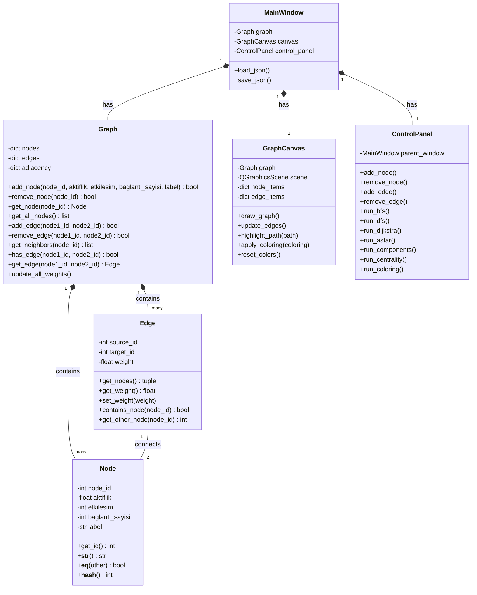

### 4.3 Modül İlişkileri

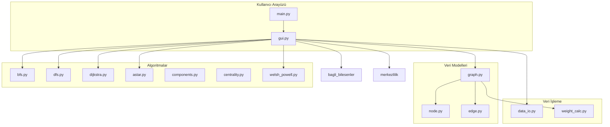

---

## 5. Algoritmalar

### 5.1 BFS (Breadth-First Search) - Genişlik Öncelikli Arama

#### Çalışma Mantığı

BFS algoritması, başlangıç düğümünden itibaren grafı katman katman (seviye seviye) dolaşır. Önce başlangıç düğümünün tüm komşuları ziyaret edilir, ardından bu komşuların komşuları ziyaret edilir ve bu şekilde devam eder.

#### Akış Diyagramı

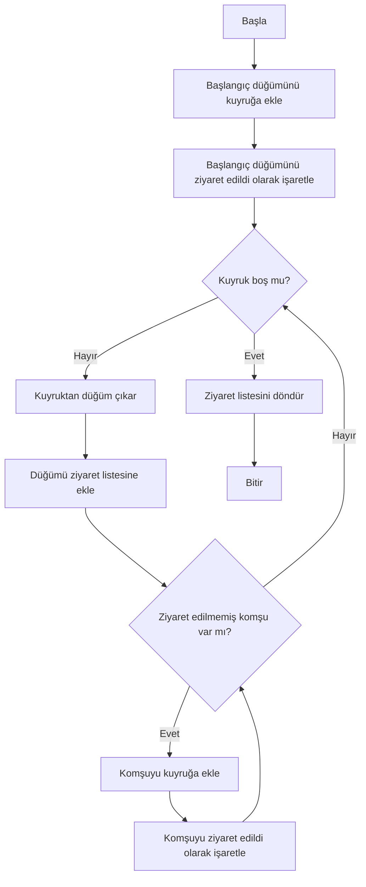

#### Pseudo Kod

```
BFS(Graf G, Başlangıç s):
    kuyruk ← boş kuyruk
    ziyaret_edildi ← boş küme
    
    kuyruk.ekle(s)
    ziyaret_edildi.ekle(s)
    
    while kuyruk boş değil:
        u ← kuyruk.çıkar()
        for her komşu v ∈ G.komşular(u):
            if v ∉ ziyaret_edildi:
                ziyaret_edildi.ekle(v)
                kuyruk.ekle(v)
    
    return ziyaret_edildi
```

#### Karmaşıklık Analizi

| Metrik | Değer | Açıklama |
|--------|-------|----------|
| **Zaman Karmaşıklığı** | O(V + E) | V: düğüm sayısı, E: kenar sayısı |
| **Alan Karmaşıklığı** | O(V) | Kuyruk ve ziyaret listesi için |

#### Literatür

BFS algoritması ilk olarak 1959 yılında Edward F. Moore tarafından labirent çözümü için geliştirilmiştir. Daha sonra 1961'de C.Y. Lee tarafından kablo yönlendirme problemlerine uygulanmıştır [1].

---

### 5.2 DFS (Depth-First Search) - Derinlik Öncelikli Arama

#### Çalışma Mantığı

DFS algoritması, bir dalı sonuna kadar takip eder ve çıkmaza ulaştığında geri dönerek başka dalları keşfeder. Özyinelemeli veya yığın kullanarak iteratif olarak uygulanabilir.

#### Akış Diyagramı

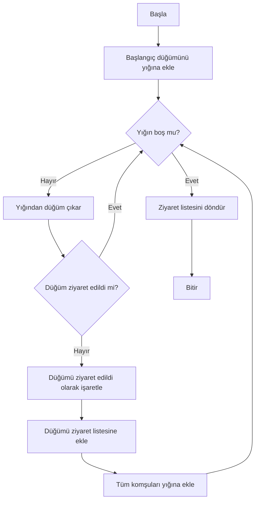

#### Pseudo Kod

```
DFS(Graf G, Başlangıç s):
    yığın ← boş yığın
    ziyaret_edildi ← boş küme
    
    yığın.ekle(s)
    
    while yığın boş değil:
        u ← yığın.çıkar()
        if u ∉ ziyaret_edildi:
            ziyaret_edildi.ekle(u)
            for her komşu v ∈ G.komşular(u):
                yığın.ekle(v)
    
    return ziyaret_edildi
```

#### Karmaşıklık Analizi

| Metrik | Değer | Açıklama |
|--------|-------|----------|
| **Zaman Karmaşıklığı** | O(V + E) | V: düğüm sayısı, E: kenar sayısı |
| **Alan Karmaşıklığı** | O(V) | Yığın derinliği en fazla V olabilir |

#### Literatür

DFS algoritması 19. yüzyılda labirent çözümü için Trémaux tarafından incelenmiştir. Modern formülasyonu 1972'de Hopcroft ve Tarjan tarafından yapılmıştır [2].

---

### 5.3 Dijkstra Algoritması

#### Çalışma Mantığı

Dijkstra algoritması, ağırlıklı bir grafta tek bir kaynak düğümünden diğer tüm düğümlere olan en kısa yolları bulur. Algoritma, her adımda en küçük mesafeye sahip düğümü seçer ve komşularının mesafelerini günceller.

#### Akış Diyagramı

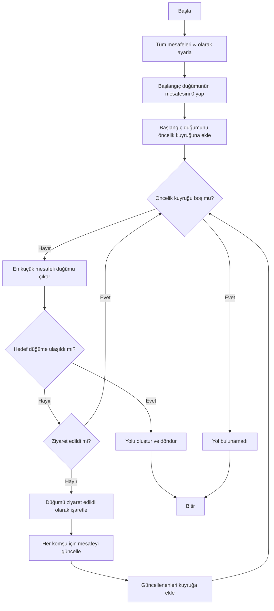

#### Pseudo Kod

```
Dijkstra(Graf G, Başlangıç s, Hedef t):
    mesafe[v] ← ∞ for all v ∈ V
    mesafe[s] ← 0
    önceki[v] ← tanımsız for all v ∈ V
    öncelik_kuyruğu ← {(0, s)}
    
    while öncelik_kuyruğu boş değil:
        (d, u) ← öncelik_kuyruğu.en_küçüğü_çıkar()
        
        if u = t:
            return yolu_oluştur(önceki, t)
        
        for her komşu v ∈ G.komşular(u):
            yeni_mesafe ← mesafe[u] + ağırlık(u, v)
            if yeni_mesafe < mesafe[v]:
                mesafe[v] ← yeni_mesafe
                önceki[v] ← u
                öncelik_kuyruğu.ekle((yeni_mesafe, v))
    
    return yol_yok
```

#### Karmaşıklık Analizi

| Metrik | Değer | Açıklama |
|--------|-------|----------|
| **Zaman Karmaşıklığı** | O((V + E) log V) | Min-heap kullanıldığında |
| **Alan Karmaşıklığı** | O(V) | Mesafe ve önceki dizileri için |

#### Literatür

Dijkstra algoritması 1956 yılında Hollandalı bilgisayar bilimcisi Edsger W. Dijkstra tarafından geliştirilmiş ve 1959'da yayınlanmıştır. En kısa yol problemleri için temel algoritma olarak kabul edilir [3].

---

### 5.4 A* (A-Star) Algoritması

#### Çalışma Mantığı

A* algoritması, Dijkstra algoritmasının sezgisel (heuristic) bir fonksiyonla genişletilmiş halidir. Her düğüm için `f(n) = g(n) + h(n)` değeri hesaplanır:
- `g(n)`: Başlangıçtan n'e olan gerçek maliyet
- `h(n)`: n'den hedefe tahmini maliyet (sezgisel)

Bu projede sezgisel fonksiyon olarak düğüm özelliklerinin Öklid mesafesi kullanılmaktadır:

```
h(n) = √[(aktiflik_n - aktiflik_hedef)² + (etkileşim_n - etkileşim_hedef)² + (bağlantı_n - bağlantı_hedef)²]
```

#### Akış Diyagramı

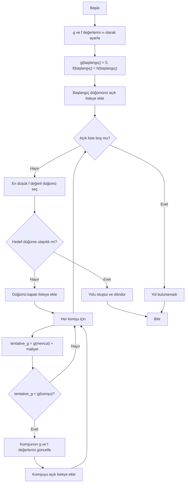

#### Karmaşıklık Analizi

| Metrik | Değer | Açıklama |
|--------|-------|----------|
| **Zaman Karmaşıklığı** | O(E) | En iyi durumda (iyi sezgisel ile) |
| **Zaman Karmaşıklığı** | O(b^d) | En kötü durumda (b: dallanma faktörü, d: derinlik) |
| **Alan Karmaşıklığı** | O(V) | Açık ve kapalı listeler için |

#### Literatür

A* algoritması 1968 yılında Peter Hart, Nils Nilsson ve Bertram Raphael tarafından Stanford Araştırma Enstitüsü'nde geliştirilmiştir. Kabul edilebilir (admissible) bir sezgisel fonksiyon kullanıldığında optimal çözümü garanti eder [4].

---

### 5.5 Bağlı Bileşenler (Connected Components)

#### Çalışma Mantığı

Bağlı bileşen analizi, grafta birbirine bağlı düğüm gruplarını tespit eder. Her bileşen, kendi içinde tamamen bağlı ancak diğer bileşenlerden izole bir alt graftır.

#### Akış Diyagramı

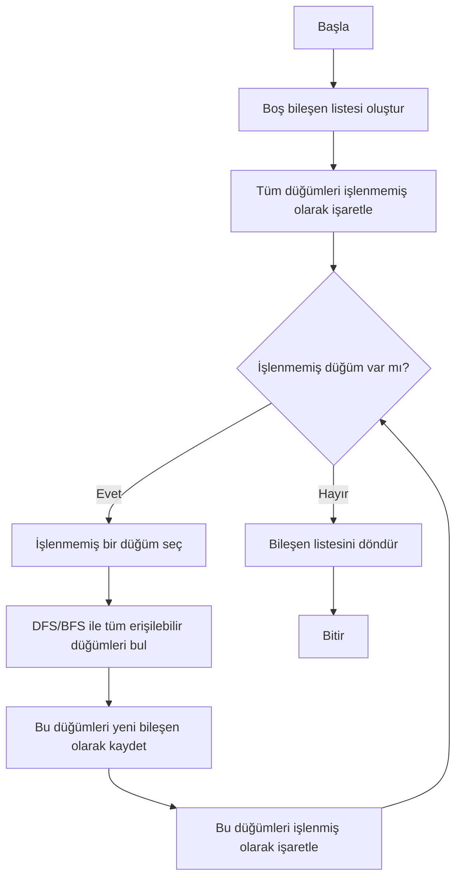

#### Karmaşıklık Analizi

| Metrik | Değer | Açıklama |
|--------|-------|----------|
| **Zaman Karmaşıklığı** | O(V + E) | Her düğüm ve kenar bir kez ziyaret edilir |
| **Alan Karmaşıklığı** | O(V) | Ziyaret listesi ve bileşen bilgisi için |

---

### 5.6 Derece Merkeziliği (Degree Centrality)

#### Çalışma Mantığı

Derece merkeziliği, bir düğümün önemini komşu sayısına göre ölçer. Yüksek derece merkeziliğine sahip düğümler, ağda daha etkili kabul edilir.

**Formül:**
```
Merkezilik(v) = derece(v) / (n - 1)
```

Burada `n` toplam düğüm sayısıdır.

#### Akış Diyagramı

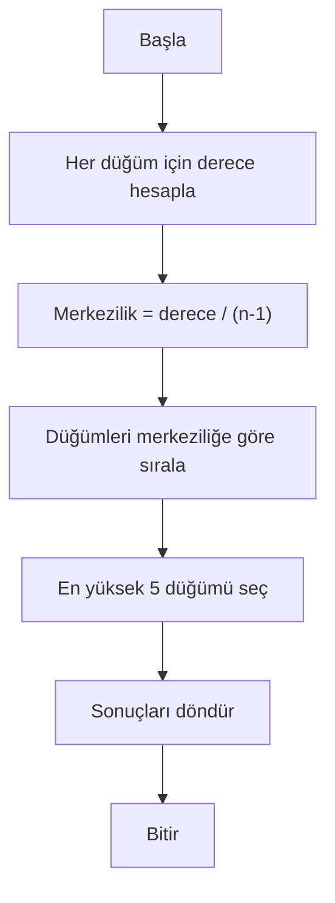

#### Karmaşıklık Analizi

| Metrik | Değer | Açıklama |
|--------|-------|----------|
| **Zaman Karmaşıklığı** | O(V + E) | Derece hesaplama |
| **Sıralama** | O(V log V) | Düğümlerin sıralanması |
| **Alan Karmaşıklığı** | O(V) | Merkezilik değerleri için |

---

### 5.7 Welsh-Powell Graf Renklendirme

#### Çalışma Mantığı

Welsh-Powell algoritması, grafı minimum renk sayısıyla boyamak için kullanılan açgözlü (greedy) bir algoritmadır. Komşu düğümlerin farklı renklere sahip olması garanti edilir.

**Algoritma Adımları:**
1. Düğümleri derecelerine göre azalan sırada sırala
2. Sırayla her düğüme, komşularında kullanılmayan en küçük rengi ata

#### Akış Diyagramı

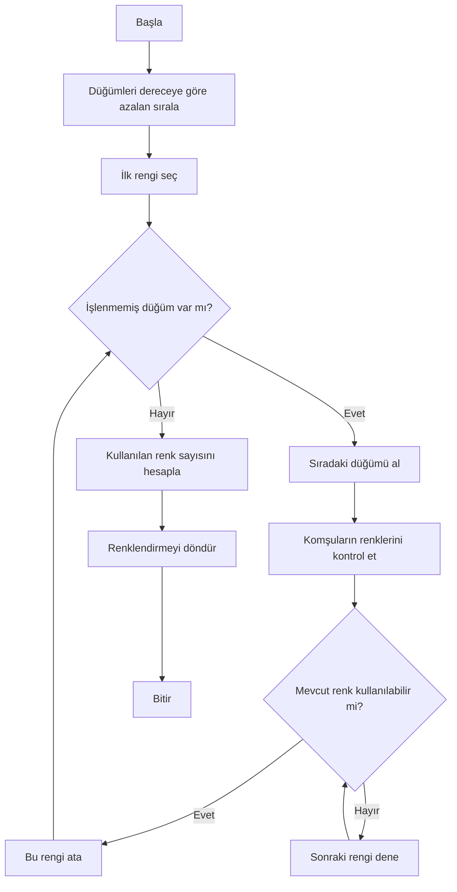

#### Karmaşıklık Analizi

| Metrik | Değer | Açıklama |
|--------|-------|----------|
| **Zaman Karmaşıklığı** | O(V² + E) | Sıralama ve renklendirme |
| **Alan Karmaşıklığı** | O(V) | Renk atamaları için |

#### Literatür

Welsh-Powell algoritması 1967 yılında D.J.A. Welsh ve M.B. Powell tarafından yayınlanmıştır. Açgözlü yaklaşım optimal sonucu garanti etmez ancak pratikte iyi sonuçlar verir [5].

---

## 6. Dinamik Ağırlık Hesaplama

### 6.1 Ağırlık Formülü

İki düğüm arasındaki kenar ağırlığı, düğümlerin özelliklerine göre dinamik olarak hesaplanır:

```
Ağırlık(i,j) = 1 / (1 + √[(Aktiflik_i - Aktiflik_j)² + (Etkileşim_i - Etkileşim_j)² + (Bağlantı_i - Bağlantı_j)²])
```

### 6.2 Formül Açıklaması

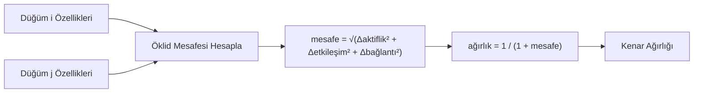

### 6.3 Ağırlık Özellikleri

| Durum | Mesafe | Ağırlık | Açıklama |
|-------|--------|---------|----------|
| Benzer düğümler | Küçük | Yüksek (~1) | Benzer özelliklere sahip kullanıcılar |
| Farklı düğümler | Büyük | Düşük (~0) | Farklı özelliklere sahip kullanıcılar |

### 6.4 Örnek Hesaplama

**Düğüm 1:** aktiflik=0.8, etkileşim=12, bağlantı=3  
**Düğüm 2:** aktiflik=0.6, etkileşim=8, bağlantı=2

```
mesafe = √[(0.8-0.6)² + (12-8)² + (3-2)²]
       = √[0.04 + 16 + 1]
       = √17.04
       = 4.128

ağırlık = 1 / (1 + 4.128) = 0.195
```

---

## 7. Kullanıcı Arayüzü

### 7.1 Özellikler

#### Düğüm İşlemleri
- Düğüm ekleme (ID, aktiflik, etkileşim, etiket)
- Rastgele düğüm ekleme
- Düğüm silme
- Düğüm listesi görüntüleme
- Düğüm düzenleme (çift tıklama ile)

#### Kenar İşlemleri
- Graf üzerinde seçim ile kenar ekleme
- Manuel ID girişi ile kenar ekleme
- Kenar silme

#### Algoritma Çalıştırma
- Tek buton ile algoritma tetikleme
- Parametre girişi (başlangıç/bitiş düğümü)
- Sonuçların görsel ve metin olarak gösterimi
- Çalışma süresi ölçümü

#### Görselleştirme
- Sürüklenebilir düğümler
- Kenar ağırlıklarının gösterimi
- Algoritma sonuçlarının renk kodlaması
- Yol vurgulama

### 7.2 Ekran Görüntüleri

#### Ana Ekran
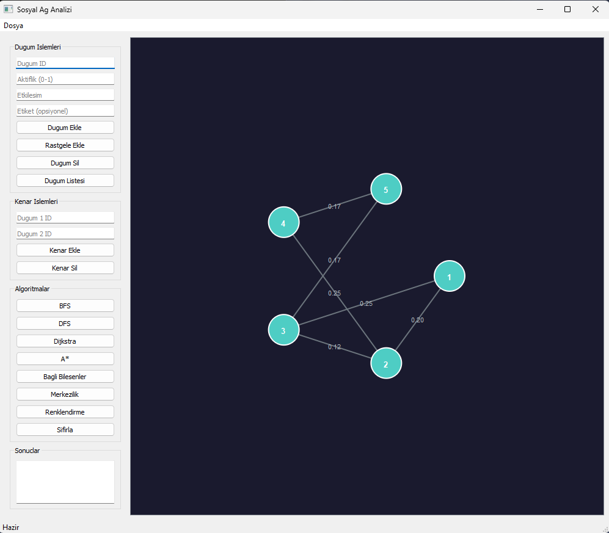

*Uygulamanın ana ekranı - Sol panelde kontroller, sağ panelde graf görünümü*

#### BFS Algoritması Sonucu
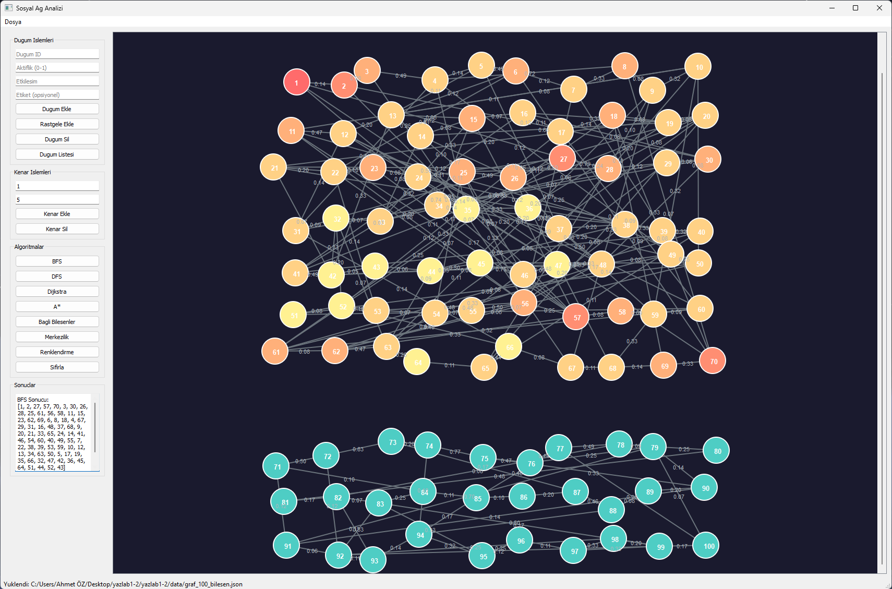

*BFS (Genişlik Öncelikli Arama) algoritması çalıştırıldıktan sonraki görünüm*

#### DFS Algoritması Sonucu
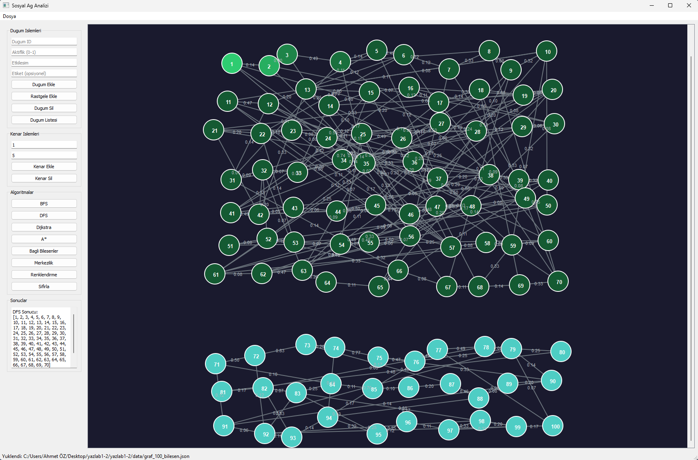

*DFS (Derinlik Öncelikli Arama) algoritması çalıştırıldıktan sonraki görünüm*

#### Dijkstra En Kısa Yol
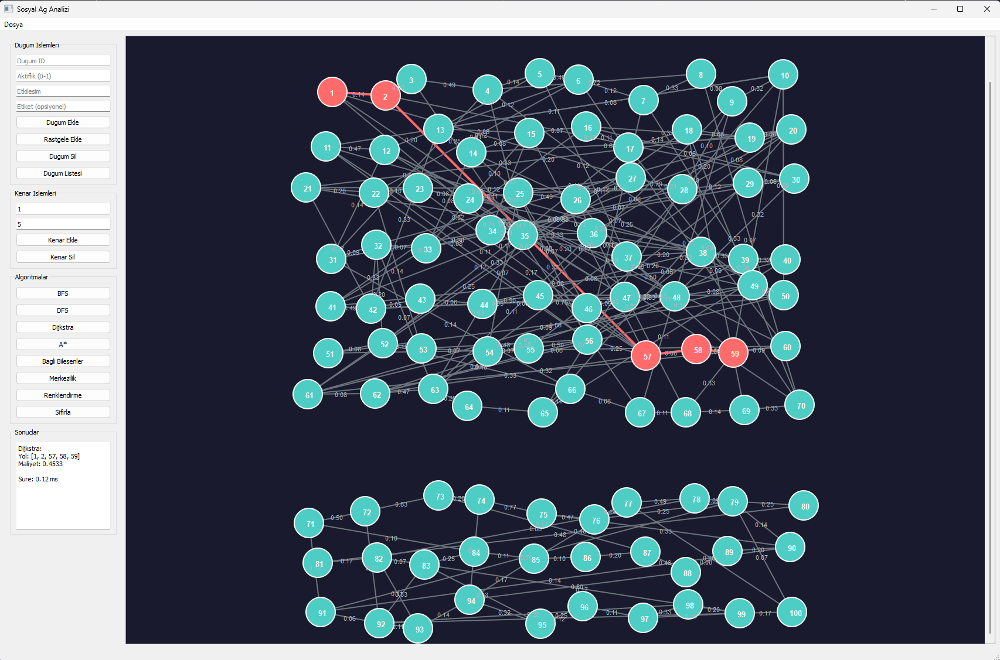

*Dijkstra algoritması ile bulunan en kısa yol (kırmızı ile vurgulanmış)*

#### A* Algoritması Sonucu
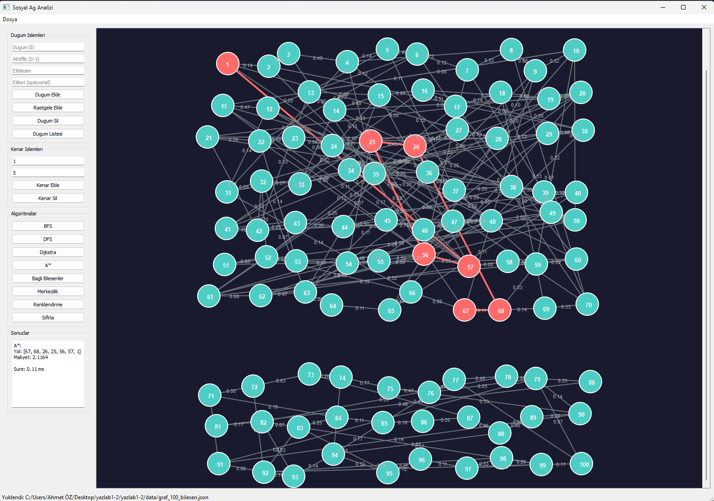

*A* algoritması ile bulunan en kısa yol*

#### Welsh-Powell Renklendirme
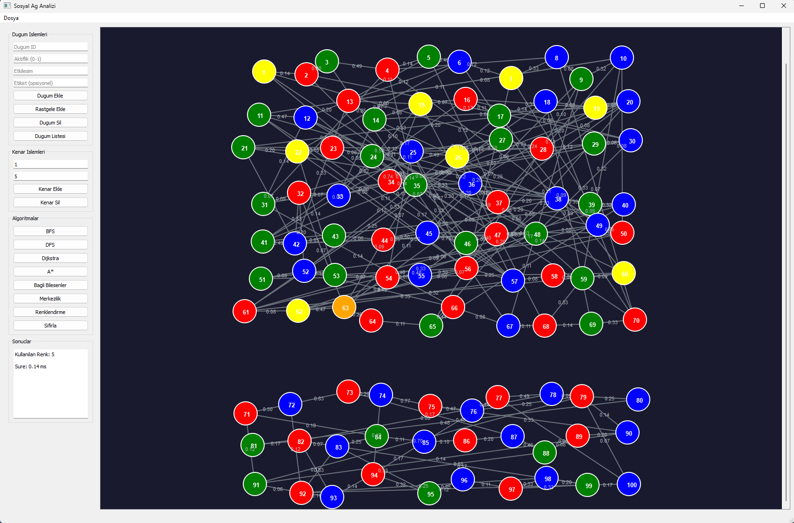

*Welsh-Powell algoritması ile graf renklendirme sonucu - Komşu düğümler farklı renklerle boyanmış*

#### PowerShell Test Çıktısı
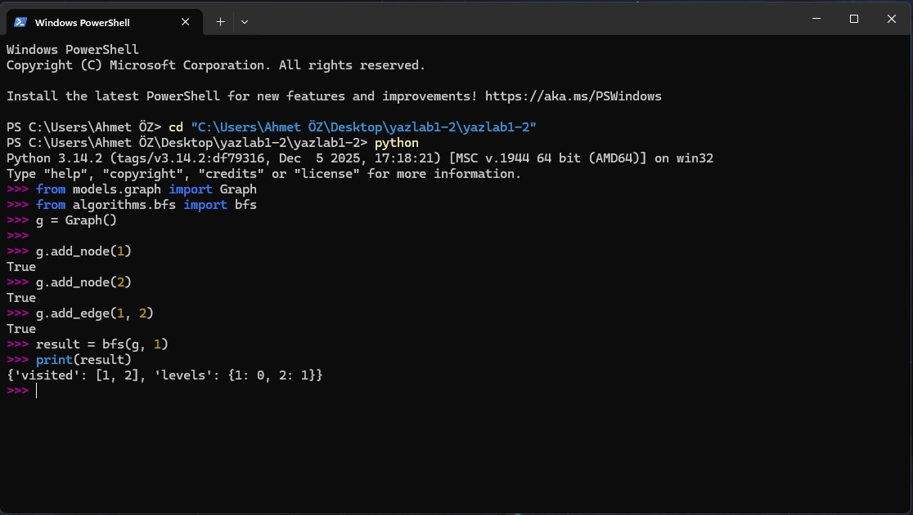

*Geliştirme sürecinde algoritmaların terminal üzerinden test edilmesi*

---

## 8. Test Sonuçları ve Performans Analizi

### 8.1 Test Ortamı

| Özellik | Değer |
|---------|-------|
| İşletim Sistemi | Windows 11 |
| İşlemci | Intel Core i7 |
| RAM | 32 GB |
| Python Versiyonu | 3.14 |

### 8.2 Küçük Ölçekli Graf Testleri (20 Düğüm)

| Algoritma | Çalışma Süresi (ms) | Bellek Kullanımı | Sonuç |
|-----------|---------------------|------------------|-------|
| BFS | 0.02 | Düşük | 20 düğüm ziyaret edildi |
| DFS | 0.01 | Düşük | 20 düğüm ziyaret edildi |
| Dijkstra | 0.03 | Düşük | Yol: 5 düğüm, Maliyet: 0.4365 |
| A* | 0.02 | Düşük | Yol: 4 düğüm, Maliyet: 1.4537 |
| Bağlı Bileşenler | 0.01 | Düşük | 1 bileşen tespit edildi |
| Derece Merkeziliği | 0.01 | Düşük | Top 5 düğüm listelendi |
| Welsh-Powell | 0.02 | Düşük | 4 renk kullanıldı |

**En Merkezi 5 Düğüm (20 Düğümlü Graf):**

| Sıra | Düğüm ID | Merkezilik Değeri |
|------|----------|-------------------|
| 1 | 14 | 0.3158 |
| 2 | 2 | 0.2632 |
| 3 | 3 | 0.2632 |
| 4 | 4 | 0.2632 |
| 5 | 8 | 0.2632 |

### 8.3 Orta Ölçekli Graf Testleri (100 Düğüm)

| Algoritma | Çalışma Süresi (ms) | Bellek Kullanımı | Sonuç |
|-----------|---------------------|------------------|-------|
| BFS | 0.03 | Düşük | 100 düğüm ziyaret edildi |
| DFS | 0.05 | Düşük | 100 düğüm ziyaret edildi |
| Dijkstra | 0.11 | Düşük | Yol: 7 düğüm, Maliyet: 0.6587 |
| A* | 0.03 | Düşük | Yol: 5 düğüm, Maliyet: 1.4445 |
| Bağlı Bileşenler | 0.04 | Düşük | 1 bileşen tespit edildi |
| Derece Merkeziliği | 0.02 | Düşük | Top 5 düğüm listelendi |
| Welsh-Powell | 0.06 | Düşük | 4 renk kullanıldı |

**En Merkezi 5 Düğüm (100 Düğümlü Graf):**

| Sıra | Düğüm ID | Merkezilik Değeri |
|------|----------|-------------------|
| 1 | 16 | 0.0909 |
| 2 | 49 | 0.0909 |
| 3 | 40 | 0.0808 |
| 4 | 88 | 0.0808 |
| 5 | 95 | 0.0808 |

### 8.4 Performans Grafiği

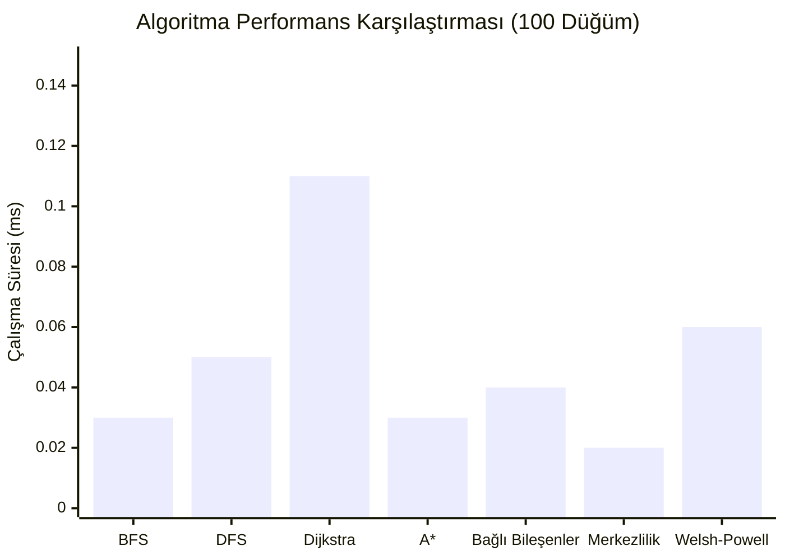

### 8.5 Graf Bilgileri

| Graf | Düğüm Sayısı | Kenar Sayısı | Bileşen Sayısı | Kullanılan Renk |
|------|--------------|--------------|----------------|-----------------|
| Küçük Ölçekli | 20 | 40 | 1 | 4 |
| Orta Ölçekli | 100 | 227 | 1 | 4 |

### 8.6 Hata Yönetimi Test Sonuçları

| Test Senaryosu | Beklenen Davranış | Sonuç |
|----------------|-------------------|-------|
| Aynı düğüm tekrar ekleme | Hata mesajı göster | ✅ Başarılı |
| Self-loop ekleme | İşlemi engelle | ✅ Başarılı |
| Geçersiz düğüm ID | Uyarı mesajı | ✅ Başarılı |
| Boş graf üzerinde algoritma | Boş sonuç döndür | ✅ Başarılı |
| Bağlantısız düğümler arası yol | Yol bulunamadı mesajı | ✅ Başarılı |

---

## 9. Kurulum ve Çalıştırma

### 9.1 Gereksinimler

```bash
Python >= 3.7
PyQt5 >= 5.15
```

### 9.2 Kurulum

```bash
# Projeyi klonlayın
git clone https://github.com/[kullanici]/yazlab1-2.git

# Dizine gidin
cd yazlab1-2

# Bağımlılıkları yükleyin
pip install PyQt5
```

### 9.3 Çalıştırma

```bash
python main.py
```

### 9.4 Örnek Veri Yükleme

1. Uygulamayı başlatın
2. Menüden **Dosya > JSON Aç** seçin
3. `data/` klasöründen örnek bir dosya seçin:
   - `graf_20_dugum.json` - 20 düğümlü küçük graf
   - `graf_100_dugum.json` - 100 düğümlü orta ölçekli graf
   - `graf_100_bilesen.json` - 100 düğümlü 2 bileşenli graf

---

## 10. Sonuç ve Tartışma

### 10.1 Sonuç

- ✅ Tüm işlevsel isterler karşılandı
- ✅ 7 farklı graf algoritması başarıyla implemente edildi
- ✅ Dinamik ağırlık hesaplama formülü doğru çalışıyor
- ✅ İnteraktif ve kullanıcı dostu arayüz tasarlandı
- ✅ JSON formatında veri içe/dışa aktarımı sağlandı
- ✅ Nesne yönelimli tasarım prensipleri uygulandı

### 10.2 Sınırlılıklar

- Çok büyük graflar (>1000 düğüm) için performans düşebilir
- Graf görselleştirmesinde otomatik düzenleme algoritması yok
- Sadece yönsüz graflar destekleniyor
- Gerçek zamanlı güncelleme özelliği mevcut değil

### 10.3 Olası Geliştirmeler

| Geliştirme | Açıklama | Öncelik |
|------------|----------|---------|
| Yönlü graf desteği | Tek yönlü bağlantılar için | Yüksek |
| Force-directed layout | Otomatik graf düzenleme | Orta |
| Daha fazla merkezilik metrikleri | Betweenness, Closeness | Orta |
| Veritabanı entegrasyonu | SQLite desteği | Düşük |
| Graf karşılaştırma | İki graf arasında benzerlik | Düşük |

---

## 11. Kaynakça

[1] Moore, E. F. (1959). "The shortest path through a maze". Proceedings of the International Symposium on the Theory of Switching.

[2] Hopcroft, J.; Tarjan, R. (1973). "Algorithm 447: efficient algorithms for graph manipulation". Communications of the ACM. 16 (6): 372–378.

[3] Dijkstra, E. W. (1959). "A note on two problems in connexion with graphs". Numerische Mathematik. 1: 269–271.

[4] Hart, P. E.; Nilsson, N. J.; Raphael, B. (1968). "A Formal Basis for the Heuristic Determination of Minimum Cost Paths". IEEE Transactions on Systems Science and Cybernetics. 4 (2): 100–107.

[5] Welsh, D. J. A.; Powell, M. B. (1967). "An upper bound for the chromatic number of a graph and its application to timetabling problems". The Computer Journal. 10 (1): 85–86.

[6] Cormen, T. H., Leiserson, C. E., Rivest, R. L., & Stein, C. (2009). Introduction to Algorithms (3rd ed.). MIT Press.

---